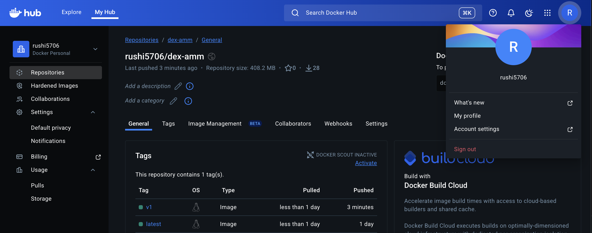
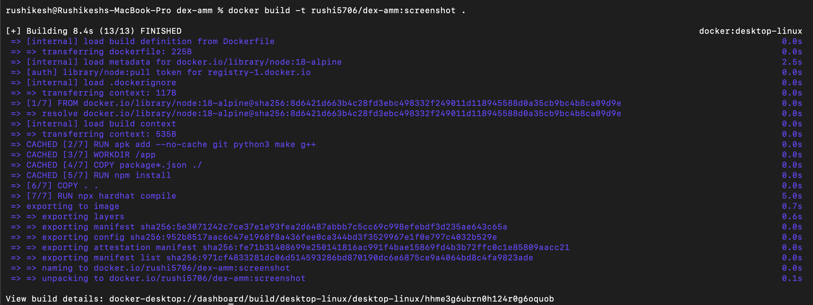
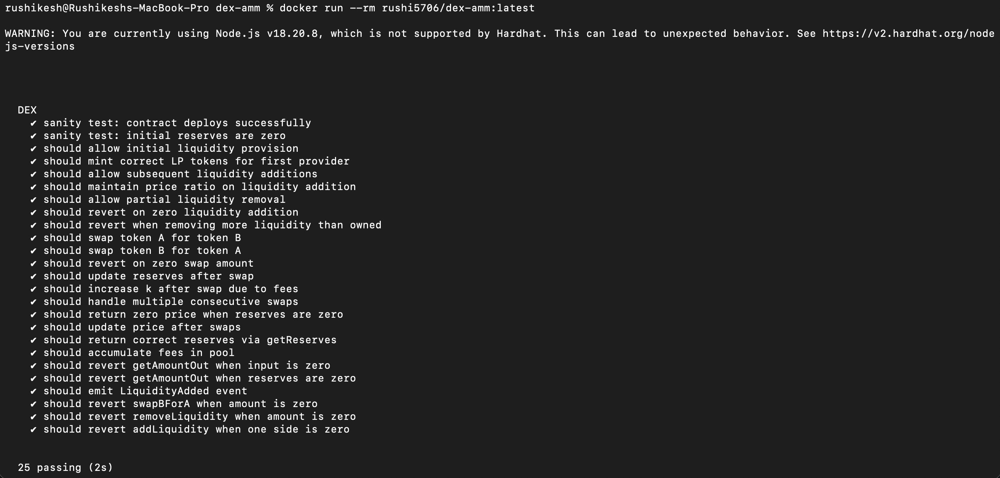
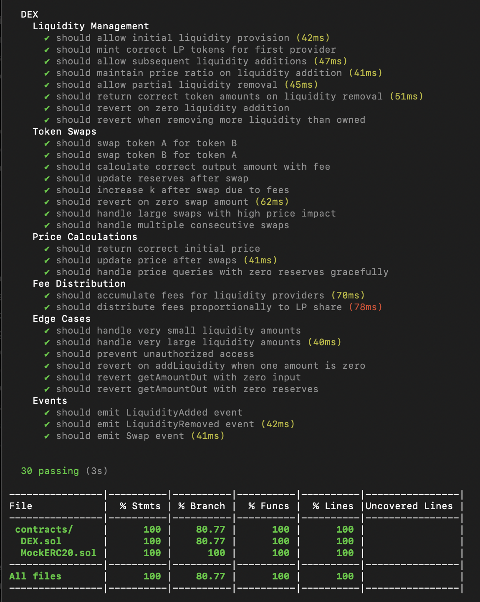
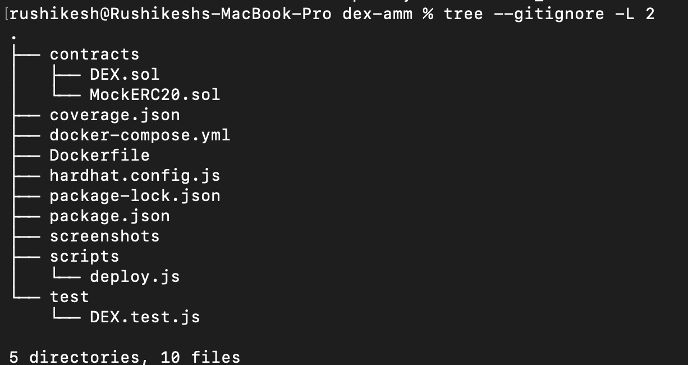

# DEX AMM Project

## Overview
This repository contains a simplified Decentralized Exchange (DEX) implemented using the Automated Market Maker (AMM) model, inspired by Uniswap V2. The project demonstrates decentralized liquidity provision, token swaps, fee accumulation for liquidity providers, full automated testing, and Dockerised execution.

---

## Running with Docker

```bash
docker-compose up -d
docker-compose exec app npm run compile
docker-compose exec app npm test
docker-compose exec app npm run coverage
docker-compose down
```

## Screenshots

The following screenshots demonstrate the successful execution, testing, and Dockerisation of the project.

### Docker Image Published on Docker Hub



This screenshot shows the publicly available Docker image for the project published on Docker Hub.

### Successful Docker Build



This screenshot confirms that the Docker image builds successfully using the provided Dockerfile without any errors.

### Tests Passing Inside Docker Container



This screenshot shows all automated test cases executing and passing inside the Docker container environment.

### Coverage Report



This screenshot displays the code coverage report, confirming that overall coverage exceeds the required threshold.

### Project Structure



This screenshot shows the final project directory structure used for submission.

---

## Setup Instructions (Local)

### Prerequisites
- Node.js
- npm
- Docker & Docker Compose

### Local Execution
```bash
npm install
npx hardhat compile
npx hardhat test
npx hardhat coverage
```

---

## Notes
- All screenshots are stored locally inside the `screenshots/` directory.
- Images render correctly when the repository is viewed on GitHub.
- No external image hosting is used.
